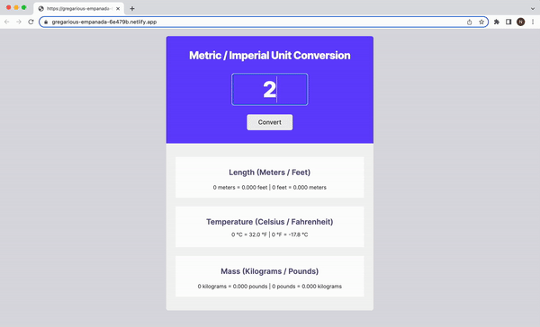

# Unit converter

Metric / Imperial Unit Conversion.

## Features
Users enter the number, press the button and that number is being converted. Available conversions are: length (meters / feet), temperature (Celsius / Fahrenheit) and mass (kilograms / pounds). When the input field is clicked, the value is being reset and users can make a new conversion.

## Demo

Test it on Netlify: https://gregarious-empanada-6e479b.netlify.app/

## Technologies
The project is built using:
* HTML
* CSS
* JavaScript

## Technical details
* Used the same function for conversion and for rendering the initial value, which is 0.
* Followed the design file on Figma.

## Project status
The project is complete.

## Acknowledgements
Unit converter is a solo project that was part of [the Frontend Developer Career Path at Scrimba](https://scrimba.com/learn/frontend).

## Contact
Created by [Natalia Davtyan](https://github.com/nataliadavtyan)